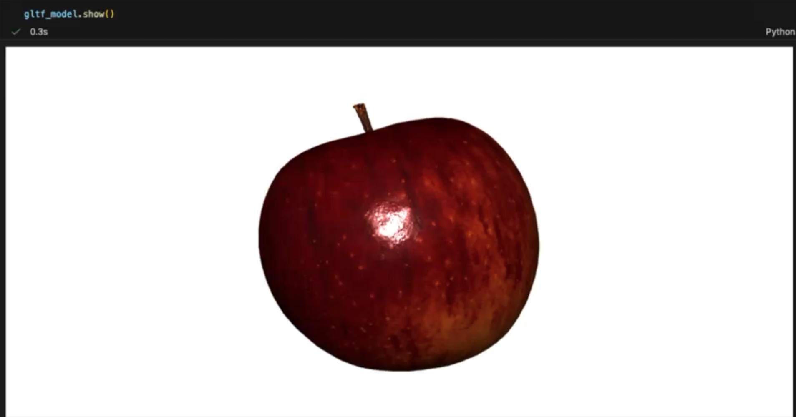
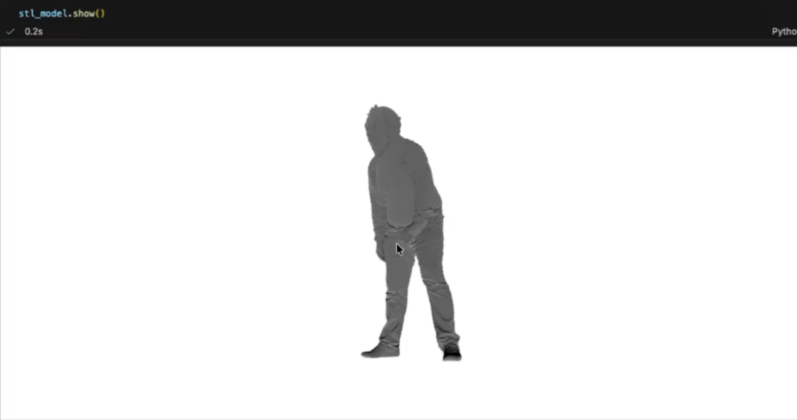
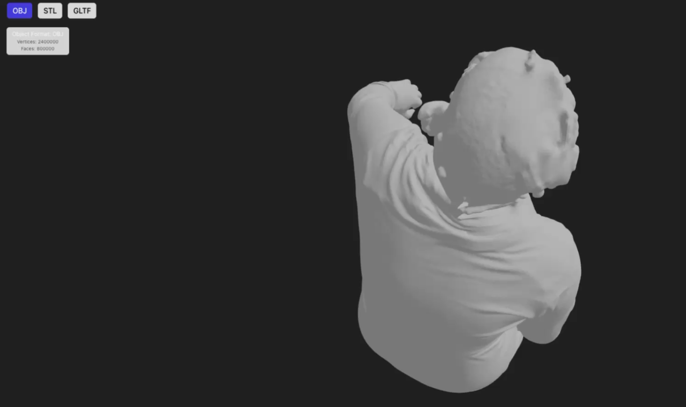
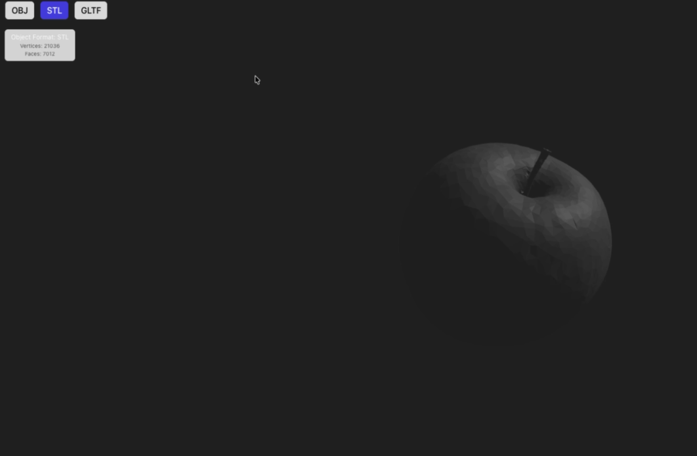

# Taller Conversión Formatos 3D

**Nombre del estudiante:** Esteban Barrera Sanabria

**Fecha de entrega:** 21 de Febrero de 2026

---

# Descripción

El objetivo del taller se centra en comparar y convertir entre distintos formatos de modelos 3D: `.OBJ`, `.STL` y `.GLTF`, y visualizar sus diferencias en geometría y materiales. El objetivo es entender la estructura interna de los archivos 3D, su compatibilidad entre entornos, y cómo se interpretan en distintas plataformas de visualización.

* Vite + React Three Fiber (Three.js)
* Python (Jupyter / Colab) usando trimesh

---

# Implementaciones

## 1) Python (Colab o Jupyter Notebook)

### Herramientas utilizadas:
- `trimesh`
- `numpy` 

`open3d` y `assimp` no contaban con soporte en versiones actuales de Python

### Funcionalidades implementadas

1. Cargar modelos `.OBJ`, `.STL`, `.GLTF` con `trimesh`.
2. Comparar propiedades geométricas: cantidad de vértices, caras, normales, e identificar duplicados.
3. Visualizar cada modelo y sus propiedades (inspección de `BufferGeometry` y `Scene`).
4. Realizar conversiones entre formatos usando `trimesh.exchange`.
5. BONUS (Realizado): script automatizado que recorre una carpeta de modelos y genera una tabla comparativa.

---

## 2) Three.js con React Three Fiber

### Herramientas utilizadas

* @react-three/fiber
* @react-three/drei
* Three.js

### Funcionalidades implementadas

1. Cargar los tres modelos convertidos (`convertido.obj`, `convertido.stl`, `convertido.gltf`) desde `threejs/public/models/`, pues desde la carpeta de `python/` se cargaron los mismos modelos
2. Permitir alternar entre ellos mediante botones.
3. Observar diferencias en renderizado: suavidad, materiales, texturas.
4. Añadir `OrbitControls` para explorar cada modelo.
5. BONUS (Realizado): mostrar en pantalla información del modelo (número de vértices y formato).

---

# Resultados Visuales

Los archivos de video están en la carpeta `media/`, demostrando los tres modelos por ambos entornos, aqui una muestra de llos en imagenes derivadas de los videos

- 
- 

Es posible divisar que el modelo `.gltf` se puede ver con los colores respectivos, pero en los tros modelos no es asi. Son los modelos antes de la conversión, por lo que es importante que se tenga en cuenta cuales imagenes son para compararlos con los modelos ya convertidos mostrados en el Threejs.

- 
- 

Son los modelos ya convertidos, se puede ver que el unico que conserva (o recupera) su color es nuevamente el `.gltf`.

---

# Código Relevante

1) Obtener estadísticas de una `BufferGeometry` en Python (trimesh/open3d):

```python
import trimesh

mesh = trimesh.load('models/convertido.obj')
print('vertices', len(mesh.vertices))
print('faces', len(mesh.faces))
```

2) Mostrar conteo de vértices/caras en React (fragmento de `App.jsx`):

```jsx
// Después de cargar el modelo con useLoader / useGLTF
const stats = statsFromObject3D(loadedObject)
setStats(stats)
```

---

# Prompts Utilizados

Durante el desarrollo se utilizaron herramientas de IA generativa para:

* Resolver errores de tipado en TypeScript.
* Manejar conversión de `Scene` a `Trimesh`.

Los prompts se enfocaron esencialmente en corrección de errores de versiones específicos.

---

# Aprendizajes y Dificultades

## Aprendizajes

* Los distintos formatos almacenan la geometría y los materiales de formas diferentes; `.gltf` suele contener texturas y PBR, `.obj` usa `.mtl` separado y `.stl` contiene solo geometría (sin materiales ni texturas).
* Al cargar modelos en entornos distintos (Python vs Three.js) es importante validar la estructura devuelta por el loader (`Scene`, `Group`, `Mesh`, `BufferGeometry`).
* Servir archivos estáticos correctamente (por ejemplo colocar los modelos en `threejs/public/models/`) evita errores de carga por parte de Vite.

## Dificultades

* Error de entorno en Python cuando faltaban dependencias (`scipy`) usadas por `trimesh`.
* Algunos loaders devuelven `Scene` o `Group` en lugar de `Mesh`, por lo que hay que recorrer la jerarquía para sumar geometrías.
* Modelos muy grandes (millones de vértices) pueden producir archivos de gran tamaño y tardar en renderizar.

---

# Conclusión

En este taller se comprobó que cada formato 3D tiene ventajas y limitaciones: `.gltf` es más completo para materiales y texturas PBR, `.obj` es simple y ampliamente soportado pero depende de archivos `.mtl` externos, y `.stl` es útil para geometría pura pero no almacena materiales ni texturas. La conversión entre formatos es posible con herramientas como `trimesh` o `assimp`, pero es importante verificar las propiedades resultantes (vértices, caras, normales y texturas) y probar los modelos en el entorno final de visualización. Como buena práctica, mantener copias de los modelos originales y usar flujos automatizados de verificación ayuda a detectar pérdidas de información durante conversiones.

