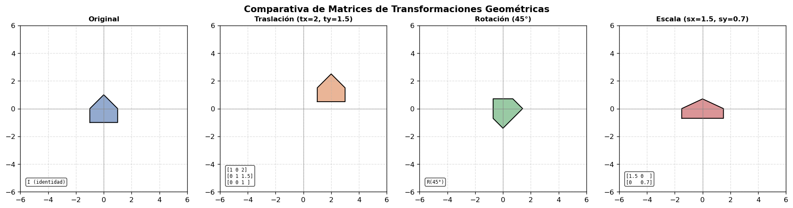
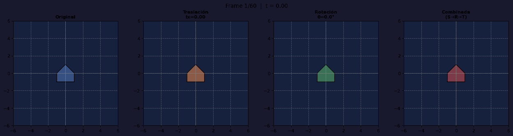
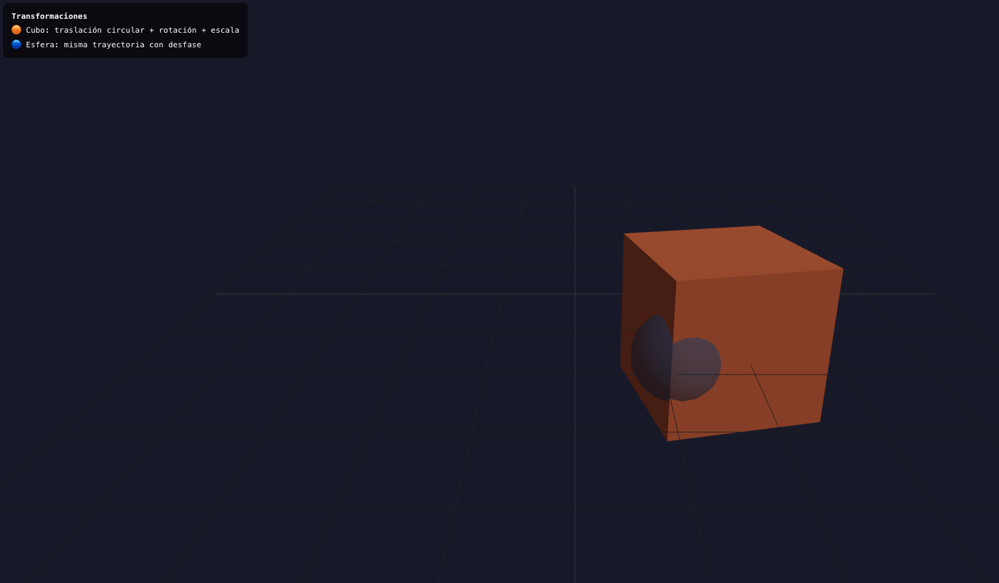
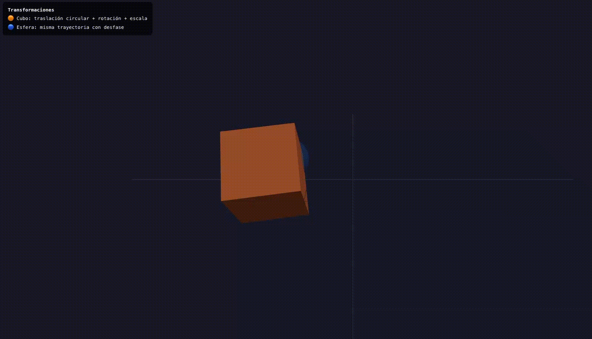
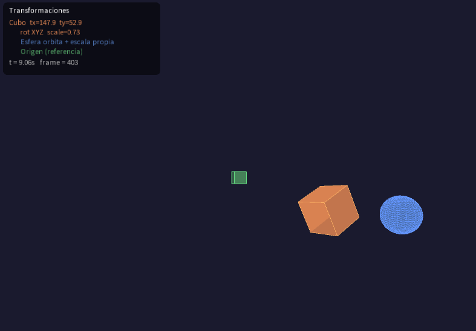
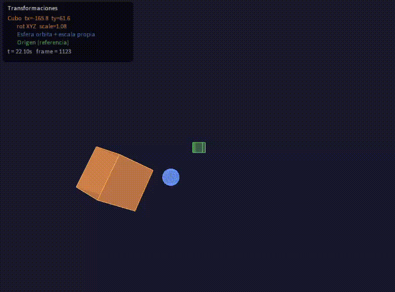

# Taller Transformaciones Básicas

**Nombre del estudiante:** Esteban Barrera Sanabria

**Fecha de entrega:** 21 de febrero de 2026

---

## Descripción

El objetivo del taller es explorar los conceptos fundamentales de transformaciones geométricas (traslación, rotación y escala) en distintos entornos de programación visual. Se completaron las transformaciones con animaciones en en funcion del tiempo y tambien transformaciones estaticas.

**Entornos utilizados:**

- Python (Jupyter Notebook)
- Three.js (Vite + React Three Fiber)
- Processing

---

## Implementaciones

### 1) Python (Jupyter Notebook)

**Herramientas utilizadas:**

- `numpy` — matrices de transformación homogéneas
- `matplotlib` — visualización y generación de frames
- `imageio` — exportación del GIF animado

**Funcionalidades implementadas:**

1. Figura 2D base en forma de flecha/casa definida con puntos.
2. Matrices de transformación homogéneas para traslación, rotación y escala implementadas desde cero con `numpy`.
3. Comparativa estática de las 4 transformaciones (original, traslación, rotación, escala) y para el punto adicional, se muestra la matriz correspondiente en cada panel.
4. Animación en función del tiempo `t ∈ [0,1)` generada con un bucle de 60 frames — cada frame aplica transformaciones interpoladas.

---

### 2) Three.js con React Three Fiber (Vite Project)

**Herramientas utilizadas:**

- Three.js
- React Three Fiber (`@react-three/fiber`)
- Drei (`@react-three/drei`)
- Vite

**Funcionalidades implementadas:**

1. Cubo 3D naranja acompañado de esfera azul (desfasada) con traslación por trayectoria circular (`sin`/`cos`), rotación continua en X e Y, y escala oscilante con `Math.sin(clock.elapsedTime)`.
2. Todas las animaciones implementadas con `useFrame`.
3. Grid de referencia para percibir el movimiento en el espacio.
4. **BONUS:** `OrbitControls` para navegar la escena libremente.

---

### 3) Processing (3D)

**Herramientas utilizadas:**

- Processing IDE

**Funcionalidades implementadas:**

1. Sketch 3D con 3 objetos: cubo naranja (principal), esfera azul (orbita el cubo) y cubo verde pequeño de referencia en el origen.
2. Transformaciones con `translate()`, `rotate()`, `scale()` animadas con `sin()`.
3. `pushMatrix()` / `popMatrix()` para aislar cada objeto con su propio contexto de transformación.
4. `frameCount` y `millis()` usados explícitamente para la animación temporal.

---

## Resultados Visuales

### Python


*Comparativa estática de las 4 transformaciones con matrices mostradas*


*Animación de 60 frames mostrando traslación, rotación, escala y combinada en función de t*

---

### Three.js


*Cubo y esfera con transformaciones activas y OrbitControls*


*Animación mostrando trayectoria circular, rotación y escala oscilante*

---

### Processing



*Sketch 3D con los 3 objetos y UI de valores en tiempo real*



*Animación mostrando pushMatrix/popMatrix y transformaciones encadenadas*

---

## Código Relevante

**Matrices de transformación homogéneas en Python:**

```python
def mat_traslacion(tx, ty):
    return np.array([[1, 0, tx],
                     [0, 1, ty],
                     [0, 0,  1]])

def mat_rotacion(angulo):
    c, s = np.cos(angulo), np.sin(angulo)
    return np.array([[c, -s, 0],
                     [s,  c, 0],
                     [0,  0, 1]])

def mat_escala(sx, sy):
    return np.array([[sx,  0, 0],
                     [ 0, sy, 0],
                     [ 0,  0, 1]])

M = mat_traslacion(tx, ty) @ mat_rotacion(angulo) @ mat_escala(sx, sy)
```

**Animación con useFrame en R3F:**

```jsx
useFrame(({ clock }) => {
  const t = clock.elapsedTime
  mesh.current.position.x = Math.sin(t) * 2
  mesh.current.position.z = Math.cos(t) * 2
  mesh.current.rotation.y += 0.02
  const s = 1 + 0.4 * Math.sin(t * 2)
  mesh.current.scale.set(s, s, s)
})
```

**pushMatrix / popMatrix en Processing:**

```java
pushMatrix();
  translate(sin(t * 0.8) * 180, cos(t * 0.6) * 80, 0);
  rotateX(t * 0.7);
  rotateY(t * 1.1);
  scale(1.0 + 0.4 * sin(t * 2.0));
  box(80);
popMatrix();
```

---

## Prompts Utilizados

Durante el desarrollo se utilizaron herramientas de IA generativa para:

1. Estructurar las matrices de transformación homogéneas en numpy.
2. Resolver el manejo de la cámara 3D en Processing.
3. Orientación sobre el uso de `clock.elapsedTime` en R3F para animaciones.

---

## Aprendizajes y Dificultades

### Aprendizajes

- En React Three Fiber, `useFrame` con `clock.elapsedTime` es la forma de animar en función del tiempo, evitando el uso de `requestAnimationFrame` manual.
- En Processing, `pushMatrix()` y `popMatrix()` son equivalentes a guardar y restaurar el estado del sistema de coordenadas, lo que permite que cada objeto tenga su propia jerarquía de transformaciones sin afectar a los demás.
- Al combinar UI 2D con una escena 3D en Processing es necesario resetear la cámara con `camera()` y usar `hint(DISABLE_DEPTH_TEST)` para que el texto siempre se dibuje encima.

### Dificultades

- En Processing, restaurar correctamente la cámara 3D después de dibujar la UI 2D requirió usar `camera()` sin argumentos en lugar de pasar valores manuales, generando el mismo error varias veces.
- Generar el GIF en memoria con `imageio` sin guardar frames intermedios requirió usar `io.BytesIO` como buffer temporal para cada frame.

---
