# Taller Espacios Proyectivos y Matrices de Proyección

**Nombre de los estudiantes:** Sebastián Andrade Cedano, Esteban Barrera Sanabria, Gabriel Andres Anzola Tachak, Angel Santiago Avendaño Cañon, Jorge Isaac Alandete Diaz

**Fecha de entrega:** 27 de febrero de  2026

---

## Descripcion breve

El objetivo es explorar los fundamentos de los espacios proyectivos y las matrices de proyección implementando escenas en múltiples entornos (Python, Unity, Processing, Three.js), comparando visualmente la proyección en perspectiva y ortográfica.

---

## Implementaciones

### 1) Python

Para esta implementación, se definieron 3 puntos en 3D con coordenadas homogeneas.

```python
puntos = np.array([
    [1,2,1,1],
    [3,4,5,1],
    [2,1,2,1]
]).T
```

Primero se hizo un plot con los 3 puntos en 3D con colores amarillo, azul y rojo, respectivamente, para hacerse a a la idea de como se ven estos en un espacio 3D.

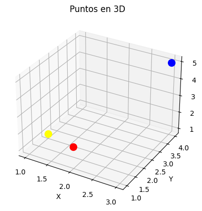

Luego se definió la siguiente función, para poder graficar la perspectiva con diferentes distancias focales.

```python
def plot_perspective(dist):
  puntos_proy = proyectar_perspectiva(puntos, d=dist)
  plt.figure()

  for i in range(puntos_proy.shape[1]):
      plt.scatter(
          puntos_proy[0, i],
          puntos_proy[1, i],
          color=colores[i],
          s=100
      )

  plt.xlabel("X proyectado")
  plt.ylabel("Y proyectado")
  plt.title(f"Proyección en Perspectiva d={dist}")
  plt.axhline(0)
  plt.axvline(0)
  plt.xlim(-5, 5)
  plt.ylim(-5, 5)

  plt.show()
```

Los gráficos obtenidos fueron los siguientes.

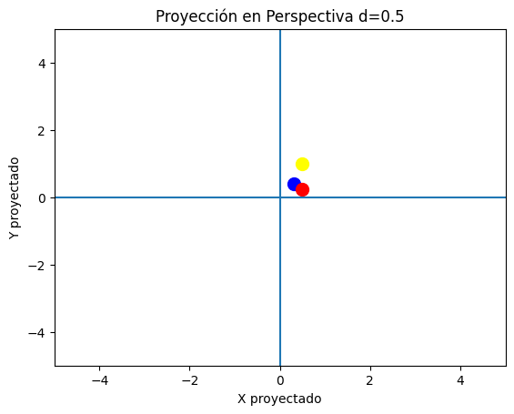

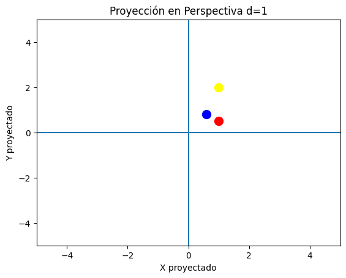

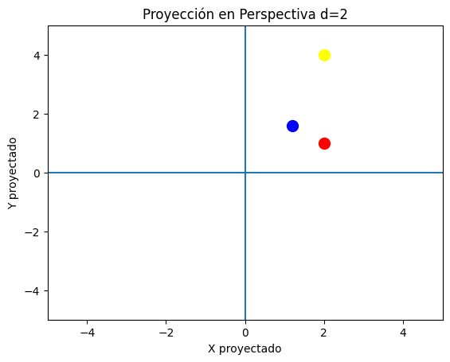

Y por último la proyección ortogonal.

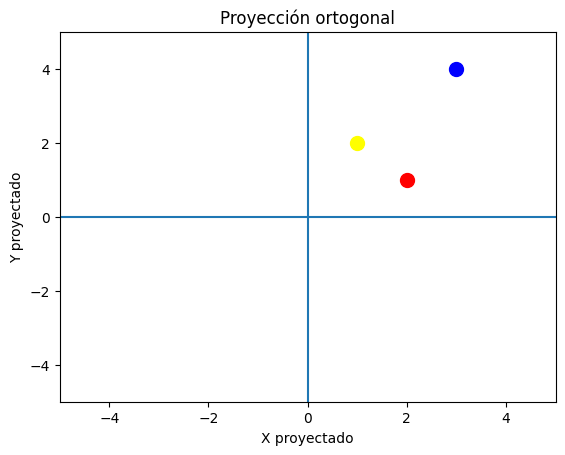

---

### 2) Unity

Para esta escena se colocaron 3 cubos alineados en el eje Z. Lo primero que observamos es como se ven estos a través de la cámara con proyección en perspectiva, la cual es la configuración por default de Unity.

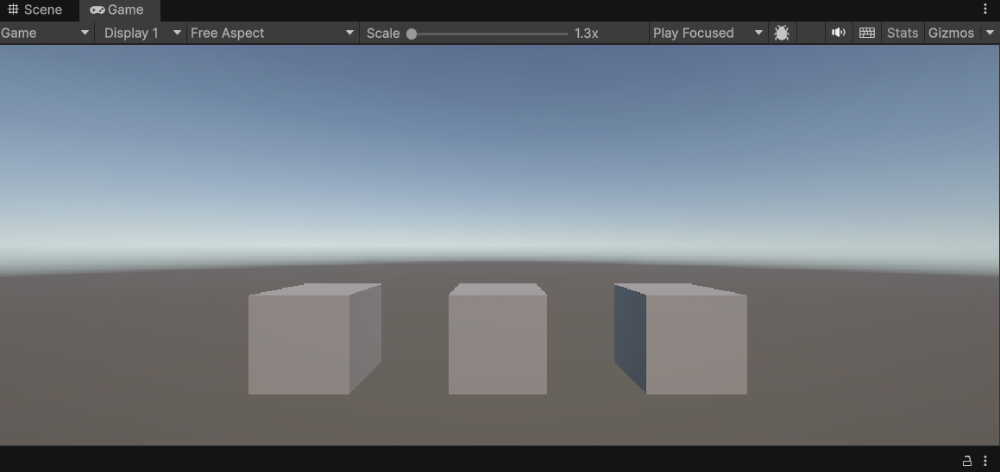

Ahora observamos la cámara en proyección ortogonal

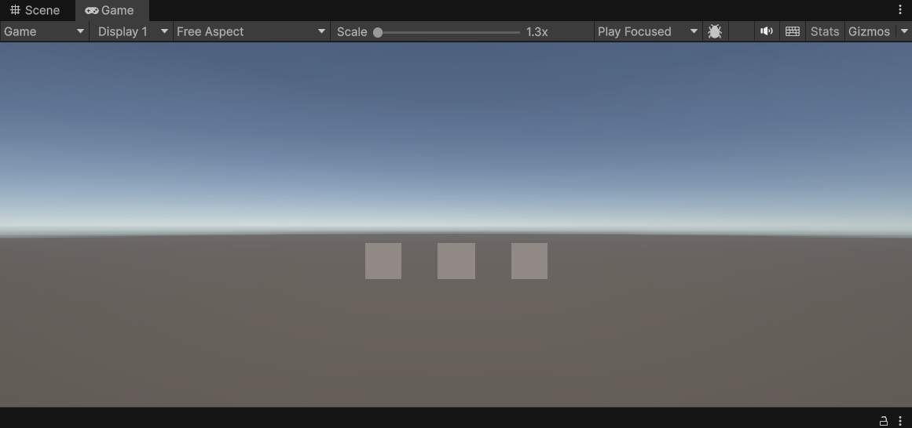

Ahora, de vuelta en la proyección en perspectiva vamos a proceder a cambiar los valores de `Field of View (FOV)` y los clipping plane `Near` y `Far`. Para observar que efecto tienen estos en la forma en la que vemos los cubos.

Con un FOV de 30, el cual es la mitad del FOV por defecto, observamos que al ser encogido el frustrum, se recorta una parte de los cubos.

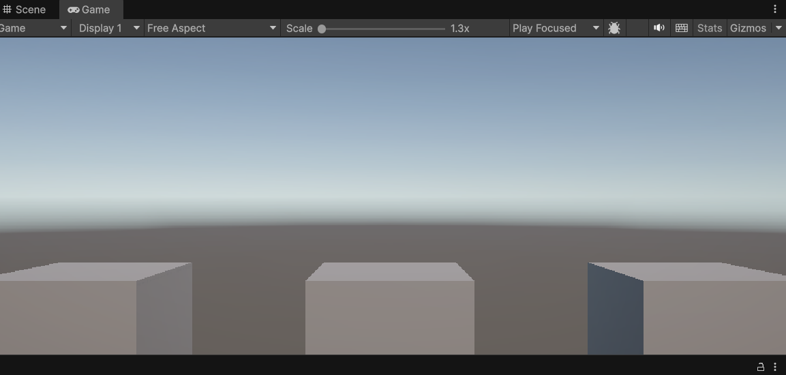

Ahora, si ajustamos el `Near` justo en 3.5 que es cuando empieza a rozar con los cubos, vemos que estos no se dibujan de manera apropiada, debido a que su cara frontal no está dentro del espacio que la cámara proyecta.

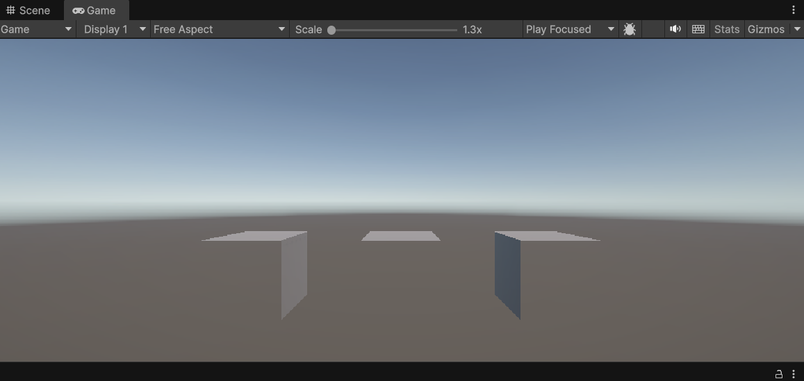

---

### 3) Processing

Para el ejercicio en processing, ubicamos 3 cubos con diferentes valores de `z`, y definimos una variable booleana para poder decidir si se iba a presentar la vista ortogonal o en perspectiva.

```pde
  pushMatrix();
  translate(-100, 0, -100);
  fill(255, 0, 0);
  box(80);
  popMatrix();

  pushMatrix();
  translate(0, 0, -300);
  fill(0, 255, 0);
  box(80);
  popMatrix();

  pushMatrix();
  translate(100, 0, -500);
  fill(0, 0, 255);
  box(80);
  popMatrix();
```

---

### 4) ThreeJS

Se construyó una escena 3D interactiva con las siguientes características:

Tres objetos geométricos (cubo, torus, octaedro) posicionados a diferentes profundidades: z = -8, z = 0 y z = +8.
Dos tipos de cámara intercambiables mediante botones en la interfaz:

#### PerspectiveCamera — FOV 60°, simula la visión humana con división perspectiva

#### OrthographicCamera — proyección paralela, sin reducción de tamaño por distancia

`OrbitControls` de @react-three/drei para navegación libre (orbitar, zoom, desplazar).
Panel informativo que muestra la descripción y la matriz de proyección correspondiente a la cámara activa.
Animación de rotación continua en los objetos y niebla volumétrica para reforzar la percepción de profundidad.

Los tres objetos se definen en un array con su posición, geometría y color. La separación deliberada en `z` es lo que permite que la diferencia entre cámaras sea visible.

```jsx
const objects = [
  { pos: [-4, 0, -8], geo: "box",        color: "#FF6B6B", label: "Lejos (z = -8)"  },
  { pos: [0,  0,  0], geo: "torus",      color: "#4ECDC4", label: "Medio (z = 0)"   },
  { pos: [4,  0,  8], geo: "octahedron", color: "#FFE66D", label: "Cerca (z = +8)"  },
];
```

useFrame se ejecuta en cada frame del loop de render de Three.js. Aquí se usa para rotar los objetos continuamente, lo que ayuda a percibir su volumen 3D independientemente de la cámara activa.

```jsx
useFrame(({ clock }) => {
  const t = clock.getElapsedTime();
  meshRefs.current.forEach((mesh, i) => {
    if (mesh) mesh.rotation.y = t * 0.4 * (i % 2 === 0 ? 1 : -1);
  });
});
```

Finalmente se puede demostrar la diferencia visual entre ambas camaras:

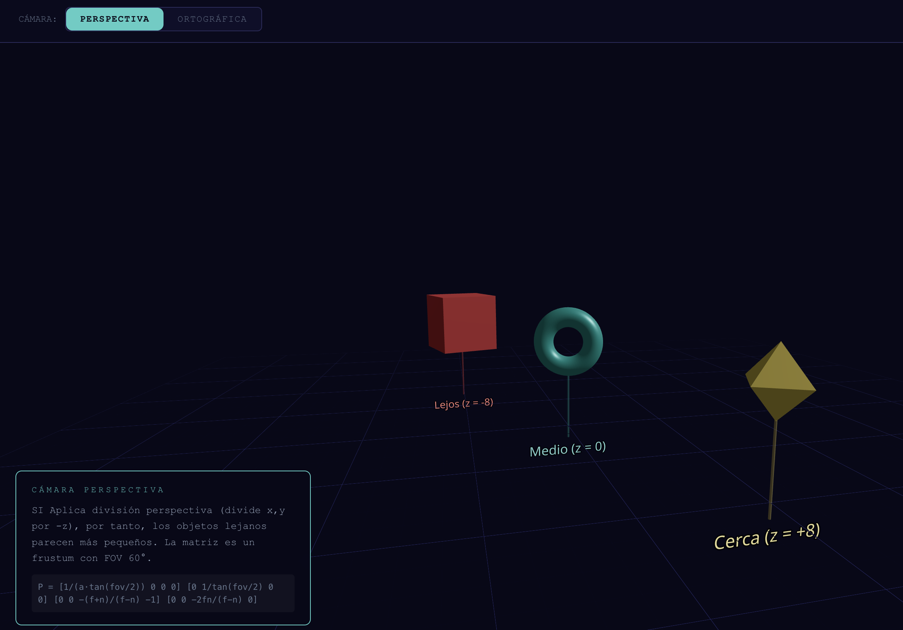

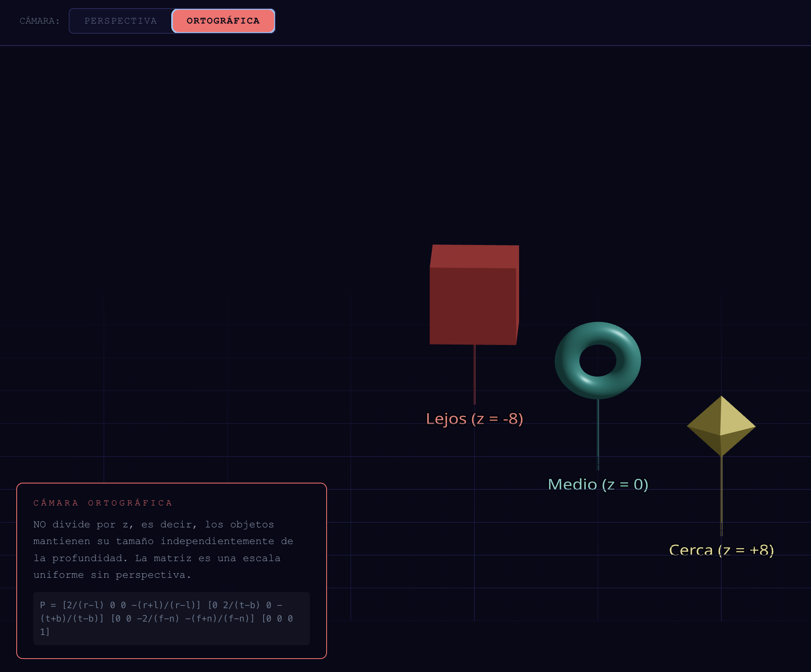

#### Proyección en perspectiva

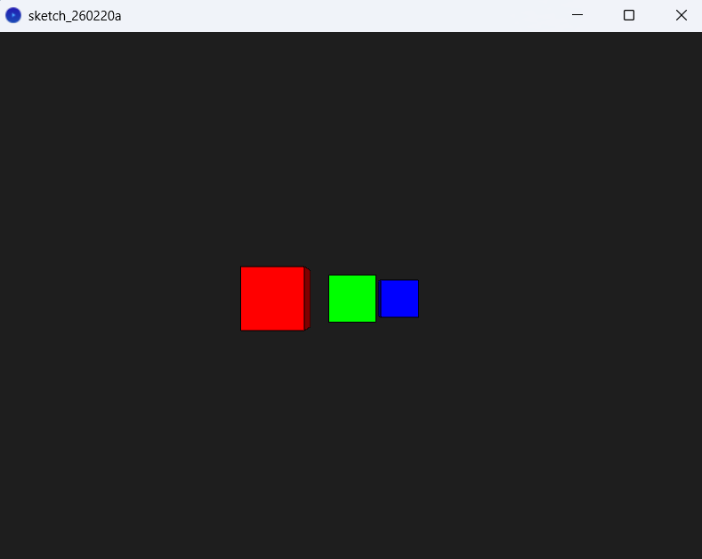

#### Proyección ortogonal

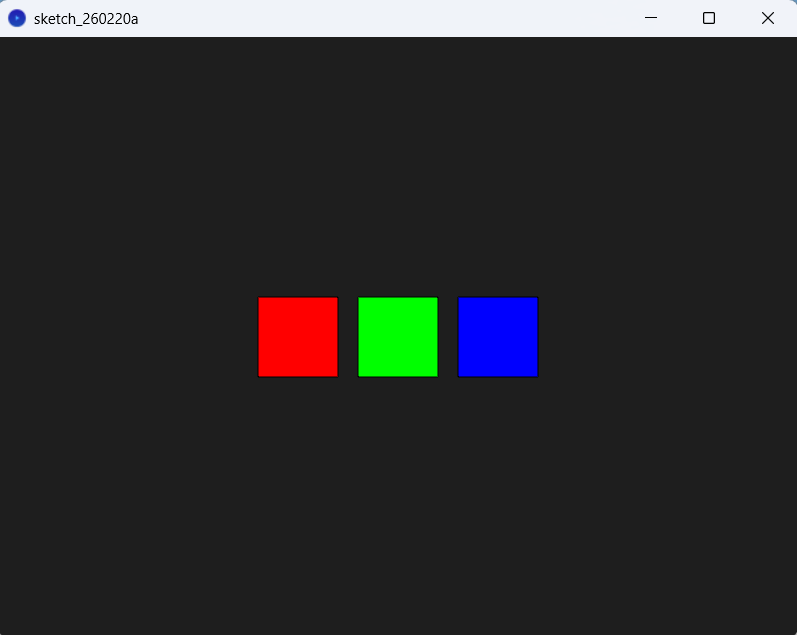

---

## Aprendizajes y dificultades

- Las "Cámaras" en motores gráficos son en realidad una matriz de proyección.
- La diferencia entre perspectiva y ortográfica se reduce a si hay o no división perspectiva: dividir (x, y) entre la profundidad z. Eso es todo lo que cambia matemáticamente.
- Coordinar que ambas cámaras en Three.js compartan la misma posición fue necesario para que la comparativa fuera válida. Si no, las diferencias podían atribuirse a la posición y no a la proyección.
