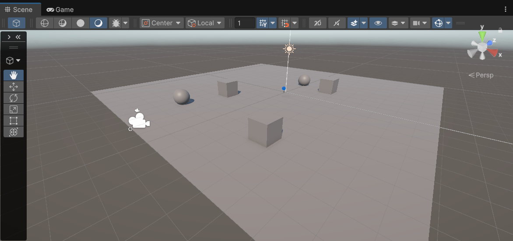
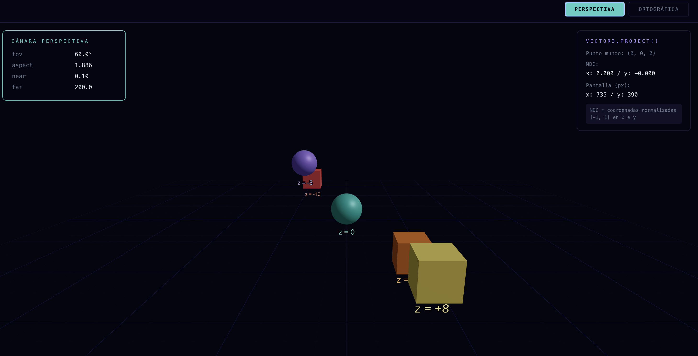
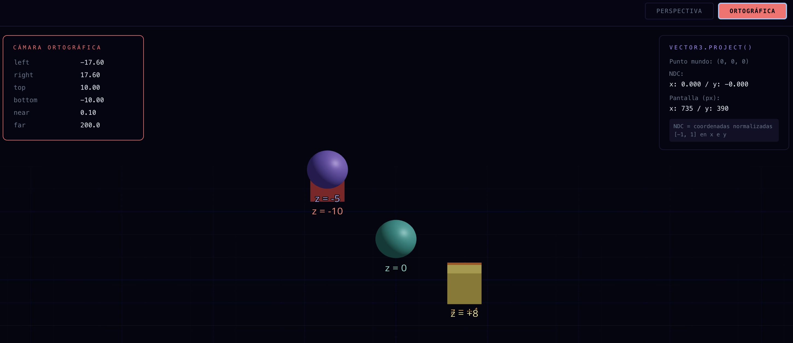

# Taller Proyecciones 3D: Cómo ve una una cámara virtual

**Nombre de los estudiantes:** Sebastián Andrade Cedano, Esteban Barrera Sanabria, Gabriel Andres Anzola Tachak, Angel Santiago Avendaño Cañon, Jorge Isaac Alandete Diaz

**Fecha de entrega:** 27 de febrero de  2026

## Descripción breve

El objetivo del taller consiste en experimentar con los diversos tipos de proyección de las cámaras en Unity, y con los párametros que estas tienen.

## Implementaciones (con resultados visuales y codigo relevante)

### 1) Unity

Se ubicó un plano en la escena, y se ubicaron sobre este varios cubos y esferas en distintas posiciones.



Se agregó también un toggle button, un slider y un TMP Text, cuyas funciones son: cambiar entre cámara ortográfica y en perspectiva, modificar el FOV o el Size, e imprimir la matriz de proyección que la cámara está aplicando en un momento dado.

En el script se agregaron estos Game Objects y se manejan de la siguiente forma:

El método `SwitchMode` nos permite cambiar el modo de la cámara usando el toggle button, se encarga de configurar los valores máximos y mínimos del slider para configurar o el size de la proyección ortográfica o el fov de la perspectiva.

```C#
    public void SwitchMode()
    {
        if(orthographic.isOn)
        {
            cam.orthographic = true;
            float orthoSize = cam.orthographicSize;
            label.text = $"Size: {orthoSize.ToString("F2")}";
            slider.maxValue = 20;
            slider.value = orthoSize;
        }
        else
        {
            cam.orthographic = false;
            float fov = cam.fieldOfView;
            label.text = $"FOV: {fov.ToString("F2")}";
            slider.maxValue = 169;
            slider.value = fov;
        }

        matrixText.text = cam.projectionMatrix.ToString("F2");
    }
```

El método `ManageSlider` se encarga de detectar el modo actual de la cámara y en base a ese modo configurar el párametro size o fov, para ortográfica o perspectiva, respectivamente.

```C#
    public void ManageSlider()
    {
        float value = slider.value;

        if(orthographic.isOn)
        {
            cam.orthographicSize = value;
            label.text = $"Size: {value.ToString("F2")}";
        }
        else
        {
            cam.fieldOfView = value;
            label.text = $"FOV: {value.ToString("F2")}";
        }

        matrixText.text = cam.projectionMatrix.ToString("F2");
    }
```

---

### 2) Threejs

Se demuestra cómo funcionan las proyecciones de cámaras virtuales en tiempo real. Al permitir cambiar entre dos tipos de proyección (perspectiva y ortográfica), se puede visualizar cómo se transforman los puntos 3D a coordenadas 2D de pantalla.

El codigo royecta puntos del espacio mundo a coordenadas de pantalla, mostrando las coordenadas normalizadas (NDC), luego realiza dos proyecciones de camaras independientes, y para que sean mas diferenciables tambien muestra en tiempo real los parametros activos con cada camara

Por ejemplo, este código implementa la transformación de proyección: convierte coordenadas 3D del mundo a coordenadas 2D de pantalla usando la matriz de proyección de la cámara activa.

```javascript
function ProjectedCoords({ onUpdate }) {
  const { camera, size } = useThree();
  const worldPos = new THREE.Vector3(0, 0, 0);

  useFrame(() => {
    // Proyecta el punto 3D al espacio normalizado [-1, 1]
    const v = worldPos.clone().project(camera);
    // Convierte coordenadas normalizadas a píxeles de pantalla
    const x = ((v.x + 1) / 2) * size.width;
    const y = ((-v.y + 1) / 2) * size.height;
    onUpdate({ x: Math.round(x), y: Math.round(y), ndc: { x: v.x.toFixed(3), y: v.y.toFixed(3) } });
  });
  return null;
}
```

Ahora bien, este componente define los dos modelos de proyección: **perspectiva** (con FOV y planos de recorte near/far) y **ortográfica** (con volumen frustum definido por left/right/top/bottom).

```javascript
function ActiveCamera({ mode }) {
  const aspect = typeof window !== "undefined" ? window.innerWidth / window.innerHeight : 1;
  const frustumSize = 20;

  return mode === "perspective" ? (
    <PerspectiveCamera makeDefault fov={60} near={0.1} far={200} position={[0, 5, 18]} />
  ) : (
    <OrthographicCamera
      makeDefault
      left={(-frustumSize * aspect) / 2}
      right={(frustumSize * aspect) / 2}
      top={frustumSize / 2}
      bottom={-frustumSize / 2}
      near={0.1} far={200}
      position={[0, 5, 18]}
    />
  );
}
```

## Escena en ejecución


Para Unity, se puede observar en el gif, como difieren la proyección ortográfica y en perspectiva, y como el cambiar los parametros de estas proyecciones deforma la manera en la que los diversos objetos se representan en la pantalla.

Y para Three.js, se evidencian las evidencias graficas de las camaras respectivas y posteriormente la animación entera entregando el compacto de como ve una camara virtual, permitiendo cambiar entre perspectivas:





---


---

## Aprendizajes y dificultades

- La proyección ortogonal difiere bastante de la perspectiva.
- Los parámetros de size y fov afectan significativamente la forma en la que se observan los objetos.
